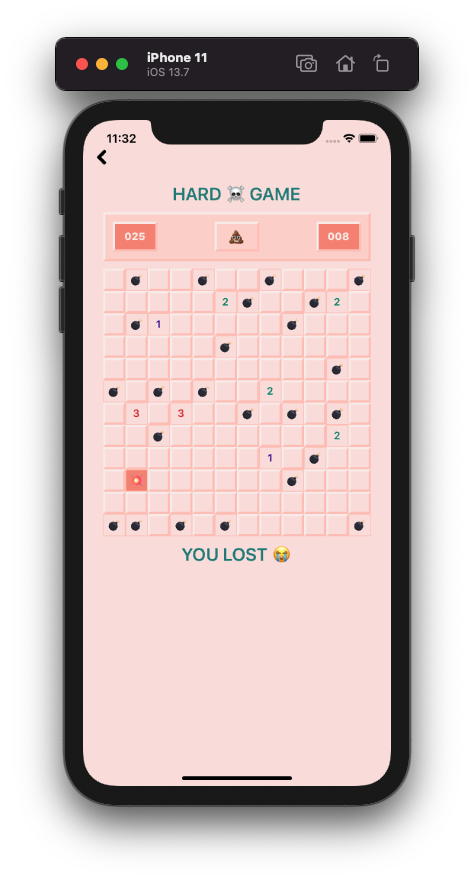

# Minesweeper Game 💣 😵

Minesweeper game made using React Native, Typescript, and Styled Components!




## How to use 💯

You'll need [Git](https://git-scm.com), [Node.js](https://nodejs.org) + [Yarn](https://yarnpkg.com/) installed to run this game on your computer.

#### Clone this repository

```bash
# Clone this repository
$ git clone git@github.com:ayelenmarie/minesweeper.git
```

#### Go inside the folder of the repository

```bash
# Go into the repository
$ cd minesweeper
```

#### Install required dependencies

```bash
# Install general dependencies
$ yarn

# Install iOS Pods
$ cd ios && pod install
```

#### Run the bundle

```bash
$ yarn start
```

#### Run the app

```bash
# iOS
$ yarn ios

# Android
$ yarn android
```

Made by [Ayelen Guini](https://www.linkedin.com/in/ayelenmarie/) with 💛  and 😸!
